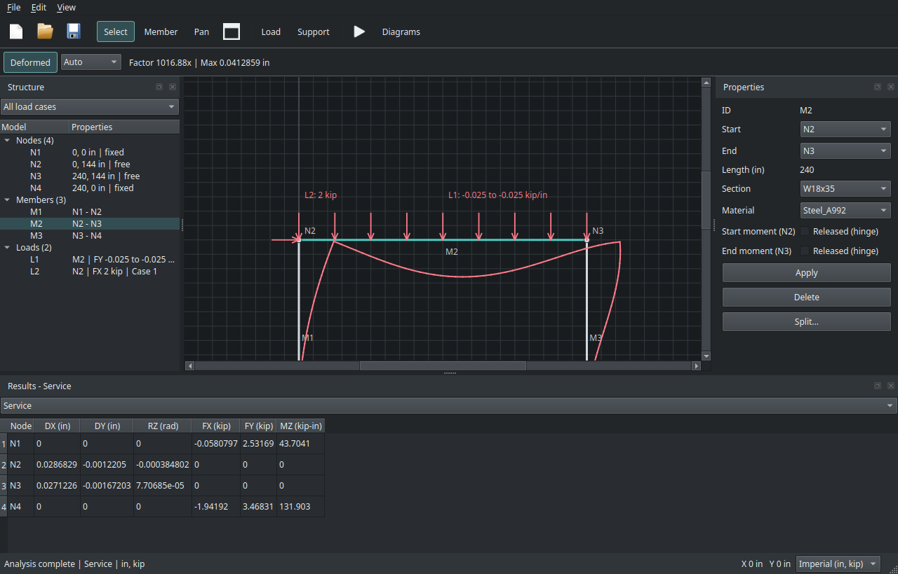
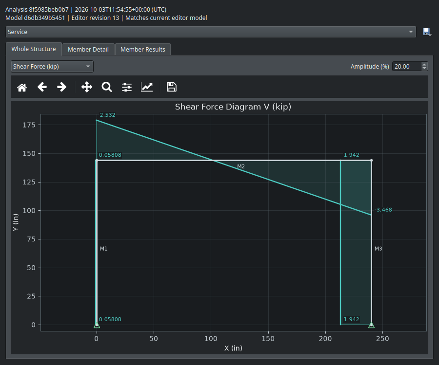

# PyniteGUI


A desktop editor for 2D/3D frames and axial-only trusses, powered by PyNite and Qt.

Draw and edit frames or trusses, assign custom or library materials and sections, and apply point,
distributed, or automatic self-weight loads. Analyze combinations and inspect
reactions, deformed shapes, force diagrams, and envelopes across combinations. Supports
SI/Imperial units, light/dark themes, undo/redo, and autosave recovery.
Model elastic support springs and 2D member-end axial, shear, or moment releases.
Analysis shows progress phases and can be cancelled without losing valid results.
Print selected definitions, results, envelopes, and 2D/3D force diagrams as a report.
3D mode adds an offline orbitable viewport, XYZ work planes, six-direction supports
and loads, constrained node dragging, member roll, biaxial bending/torsion results,
and spatial deformation.

## Quick Start

With uv installed, run from this repository:

```sh
uv python install 3.12
uv sync --managed-python
uv run pynitegui
```

Try **File > Examples** to open a ready-to-analyze beam or frame.
Start a spatial model with **File > New 3D Frame**, use **Create 3D Copy** for an
existing unreleased 2D model, or try the **3D** examples.
If 3D graphics fail to start, launch with `uv run pynitegui --software-rendering`.

## Screenshots

Frame editor with loads, deformed shape, and support reactions.



Whole-frame shear-force diagram.



## More

- [User and developer guide](GUIDE.md): workflows, units, engineering scope, and tests.
- [Roadmap](TODO.md): completed and planned features.
- [Secondary ideas](TODO_SECONDARY.md): interface inspiration and PyNite-compatible extensions.
- [License](LICENSE): GNU AGPL v3.
